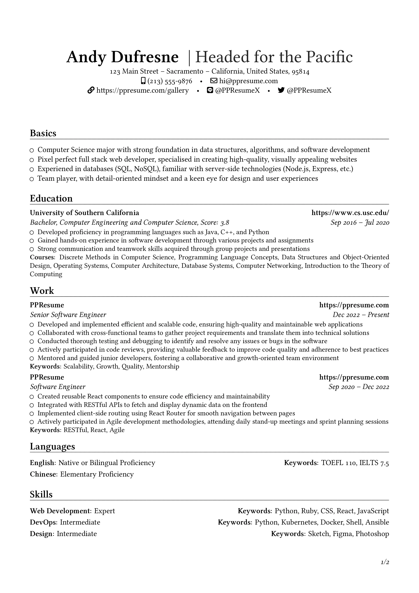

# YAMLResume

[English](./README.md) | [简体中文](./README-zh-cn.md) | [繁體中文](./README-zh-tw.md)

<!-- Build, Quality & Docs -->
[](https://github.com/yamlresume/yamlresume/actions/workflows/test.yml)
[](https://codecov.io/gh/yamlresume/yamlresume)
[](https://github.com/yamlresume/yamlresume/security)
[](https://yamlresume.dev/fr)
[](https://discord.gg/9SyT7mVV4K)

<!-- Package & Distribution -->
[](https://nodejs.org/)
[](https://www.npmjs.com/package/yamlresume)
[](https://www.npmjs.com/package/yamlresume)
[](https://hub.docker.com/r/yamlresume/yamlresume)
[](https://hub.docker.com/r/yamlresume/yamlresume)

<!-- Technology Stack -->
[](https://www.latex-project.org/)
[](https://www.typescriptlang.org/)
[](https://pnpm.io/)
[](https://conventionalcommits.org)
[](https://biomejs.dev/)
[](https://vitest.dev/)


Rédiger un CV n’est peut‑être pas difficile, mais ce n’est clairement pas amusant et c’est fastidieux.

[YAMLResume](https://yamlresume.dev/fr) vous permet de gérer et de versionner vos CV avec [YAML](https://yaml.org/) et de générer en un clin d’œil des PDF professionnels avec une belle composition typographique.


## Principe de conception

Ce projet a commencé comme le moteur de composition typographique de base de
[PPResume](https://ppresume.com/?ref=yamlresume), un générateur de CV « pixel perfect » basé sur LaTeX. Après mûre réflexion, nous avons décidé de l’ouvrir pour que chacun puisse toujours avoir le droit de dire [non au verrouillage fournisseur](https://blog.ppresume.com/posts/no-vendor-lock-in).

Le principe de conception au cœur de YAMLResume est la [séparation des responsabilités](https://fr.wikipedia.org/wiki/S%C3%A9paration_des préocupations). L’un des exemples les plus célèbres qui suit ce principe est HTML & CSS, fondations du web moderne — HTML organise le contenu d’une page, CSS définit son style de présentation.

En suivant ce principe, YAMLResume satisfait aux exigences suivantes :

- le contenu du CV est rédigé en texte brut
- le texte est structuré avec YAML — YAML est plus lisible et plus facile à écrire que JSON
- le YAML est ensuite rendu en PDF via un moteur de composition interchangeable
- la mise en page est ajustable via des options comme les tailles de police, les marges, etc.

## Démarrage rapide

Si vous avez Docker installé, vous pouvez démarrer `yamlresume` en une seconde ; l’image contient `yamlresume` et toutes ses dépendances :

[](https://asciinema.org/a/722057)

Sinon, vous pouvez installer `yamlresume` avec votre gestionnaire de paquets préféré :

```
# avec npm
$ npm install -g yamlresume

# avec yarn
$ yarn global add yamlresume

# avec pnpm
$ pnpm add -g yamlresume

# avec bun
$ bun add -g yamlresume
```

Vérifiez que `yamlresume` est bien installé :

```
$ yamlresume help
Usage: yamlresume [options] [command]

YAMLResume — Resume as Code in YAML

 __   __ _    __  __ _     ____
 \ \ / // \  |  \/  | |   |  _ \ ___  ___ _   _ ___  ___   ___
  \ V // _ \ | |\/| | |   | |_) / _ \/ __| | | / _ \/ _ \ / _ \
   | |/ ___ \| |  | | |___|  _ <  __/\__ \ |_| | | | | | |  __/
   |_/_/   \_\_|  |_|_____|_| \_\___||___/\____|_| |_| |_|\___|


Options:
  -V, --version                  output the version number
  -v, --verbose                  verbose output
  -h, --help                     display help for command

Commands:
  new [filename]                 create a new resume
  build [options] <resume-path>  build a resume to LaTeX and PDF
  dev [options] <resume-path>    build a resume on file changes (watch mode)
  languages                      i18n and l10n support
  templates                      manage resume templates
  validate <resume-path>         validate a resume against the YAMLResume schema
  help [command]                 display help for command
```

Vous devez ensuite installer un moteur de composition typographique,
[XeTeX](http://yamlresume.dev/docs/getting-started#xetex) ou
[Tectonic](http://yamlresume.dev/docs/getting-started#xetex), afin de générer des PDF.

Enfin, nous vous recommandons d’installer la police [Linux
Libertine](http://yamlresume.dev/docs/getting-started#linux-libertine) pour obtenir les meilleurs rendus.

Consultez notre [guide d’installation](http://yamlresume.dev/docs/installation) pour plus de détails.

## Créer un nouveau CV

Vous pouvez créer votre propre CV en clonant l’un de nos exemples
[ici](./packages/cli/src/commands/fixtures/software-engineer.yml). Une fois l’exemple en local, vous pouvez générer un PDF :

```
$ yamlresume new my-resume.yml
✔ Created my-resume.yml successfully.

$ yamlresume build my-resume.yml
◐ Generating resume PDF with command: xelatex -halt-on-error my-resume.tex...
✔ Generated resume PDF file successfully.
```

Vous pouvez également utiliser la [commande `dev`](https://yamlresume.dev/fr/docs/cli#dev) pour
reconstruire le CV à chaque modification de fichier, offrant **une expérience moderne de type développement web** :

```
$ yamlresume dev my-resume.yml
◐ Generating resume PDF file with command: xelatex -halt-on-error my-resume.tex...
✔ Generated resume PDF file successfully.
◐ Watching file changes: my-resume.yml...
```

Consultez le PDF généré [ici](./docs/static/images/resume.pdf).




[PPResume Gallery](https://ppresume.com/gallery/?ref=yamlresume) propose une
galerie de tous types de CV, classés par langues et modèles.

Plus d’exemples arrivent bientôt !

## Valider les CV

YAMLResume fournit un
[schéma](https://yamlresume.dev/fr/docs/compiler/schema) intégré permettant de
valider les CV et d’éviter de nombreuses erreurs de base. Démonstration :

[](https://asciinema.org/a/728098)

## Composition typographique

YAMLResume adopte [LaTeX](https://www.latex-project.org/) comme moteur de
composition par défaut, référence dans l’édition académique et technique.

En suivant les [bonnes pratiques de composition d’un CV](https://docs.ppresume.com/guide?ref=yamlresume), YAMLResume garantit des CV **Pixel Perfect**.

À l’avenir, nous pourrions prendre en charge d’autres moteurs comme
[Typst](https://github.com/typst/typst), HTML/CSS, etc.

## Écosystème

YAMLResume fournit un ensemble d’outils pour créer, convertir et gérer vos CV plus efficacement. Voici quelques utilitaires clés :

- [create-yamlresume](https://yamlresume.dev/fr/docs/ecosystem/create-yamlresume)
  facilite le démarrage d’un projet YAMLResume avec une simple commande. Il
  prépare l’arborescence, installe les dépendances nécessaires et génère un
  exemple de CV pour commencer immédiatement. Essayez avec
  `npx create-yamlresume my-resume` ou des commandes similaires pour `npm`,
  `yarn`, `pnpm` ou `bun`.
- [json2yamlresume](https://yamlresume.dev/fr/docs/ecosystem/json2yamlresume) est un
  outil CLI pour convertir des fichiers [JSON Resume](https://jsonresume.org/) au
  format YAMLResume.

## Contribuer

Ce projet est encore en développement actif ; nous travaillons en continu sur de
nouvelles fonctionnalités et corrections de bugs. L’API publique n’est pas encore
totalement stable, merci de votre patience.

Toute forme de contribution est grandement appréciée ! Merci de lire le
[guide de contribution](./CONTRIBUTING.md) avant d’ouvrir une pull request.

### Historique des étoiles

[](https://www.star-history.com/#yamlresume/yamlresume&Date)

## Feuille de route

- [ ] prise en charge de plus de familles de polices
- [ ] davantage de modèles de CV
- [ ] davantage de langues locales

## Soutenir le projet

Si YAMLResume vous est utile, envisagez de soutenir le projet :

[](https://buymeacoffee.com/xiaohanyu)


