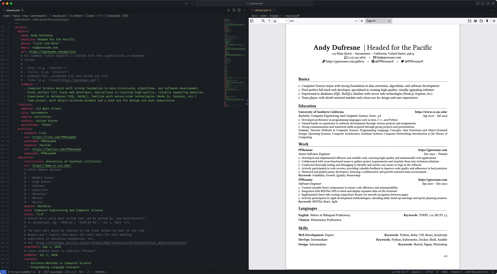

# YAMLResume

Writing resumes may not be hard, but it is definitely not fun and tedious.

[YAMLResume](https://yamlresume.dev) allows you to manage and version control
your resumes using [YAML](https://yaml.org/) and generate professional looking
PDFs with beautiful typesetting in a breeze.



## The Design Principle

This project was started as the core typesetting engine for
[PPResume](https://ppresume.com/?ref=yamlresume), a LaTeX based, pixel perfect
resume builder.  After careful consideration, we decided to open source it so
people can always have the right to say [no to vendor
lock-in](https://blog.ppresume.com/posts/no-vendor-lock-in).

The core design principle of YAMLResume is [Separation of
Concerns](https://en.wikipedia.org/wiki/Separation_of_concerns). One of the most
famous examples that follows this principle is HTML & CSS, which are the
foundation of the modern web—HTML is used for organization of webpage content,
CSS is used for definition of content presentation style.

Following the core principle, YAMLResume is implemented by satisfying the
following requirements:

- the resume content is drafted in plain text
- the plain text is structured using YAML—YAML is better than JSON because it is
  more human-readable and human-writable
- the YAML plain text is then rendered into a PDF with a pluggable typesetting
  engine
- the layout can be adjusted with options like font sizes, page margins, etc.

## Quick Start

Install `yamlresume`:

```
# using npm
$ npm install -g yamlresume

# using yarn
$ yarn global add yamlresume

# using pnpm
$ pnpm add -g yamlresume
```

Verify `yamlresume` is installed successfully:

```
$ yamlresume help

Usage: yamlresume [options] [command]

YAMLResume — Resume as Code in YAML

 __   __ _    __  __ _     ____
 \ \ / // \  |  \/  | |   |  _ \ ___  ___ _   _ ___  ___   ___
  \ V // _ \ | |\/| | |   | |_) / _ \/ __| | | / _ \/ _ \ / _ \
   | |/ ___ \| |  | | |___|  _ <  __/\__ \ |_| | | | | | |  __/
   |_/_/   \_\_|  |_|_____|_| \_\___||___/\____|_| |_| |_|\___|


Options:
  -V, --version    output the version number
  -h, --help       display help for command

Commands:
  init [filename]  initialize a new resume
  build <source>   build a resume to LaTeX and PDF
  languages        i18n and l10n support
  templates        manage resume templates
  help [command]   display help for command
```

You need to install a typesetting engine,
[XeTeX](http://yamlresume.dev/docs/getting-started#xetex) or
[Tectonic](http://yamlresume.dev/docs/getting-started#xetex) in order to
generate PDFs.

Besides, we recommend you to install [Linux
Libertine](http://yamlresume.dev/docs/getting-started#linux-libertine) font in
order to get the best looking PDFs.

## Create a new resume

You can create your own resume by cloning one of our sample resumes
[here](./packages/cli/resources/software-engineer.yml), so once you have the
sample resume on your local, you can get a pdf with:

```
$ yamlresume init my-resume.yml
$ yamlresume build my-resume.yml
```

Check the generated PDF [here](./packages/cli/resources/software-engineer.pdf).


[PPResume Gallery](https://ppresume.com/gallery/?ref=yamlresume) provides a
showcase for all possible kind of resumes categoried by languages and templates.

More samples would come soon!

## Roadmap

- [ ] support more font families
- [ ] section alias
- [ ] section reordering
- [ ] section cloning
- [ ] more resume templates
- [ ] more locale languages